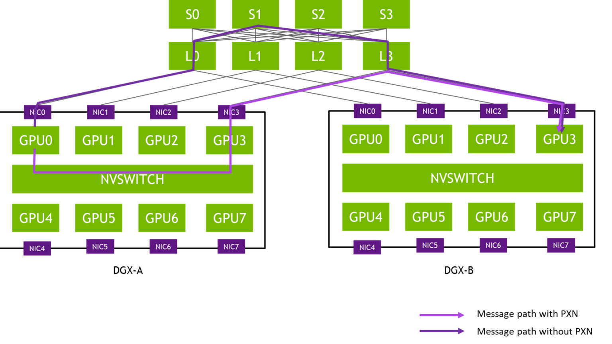
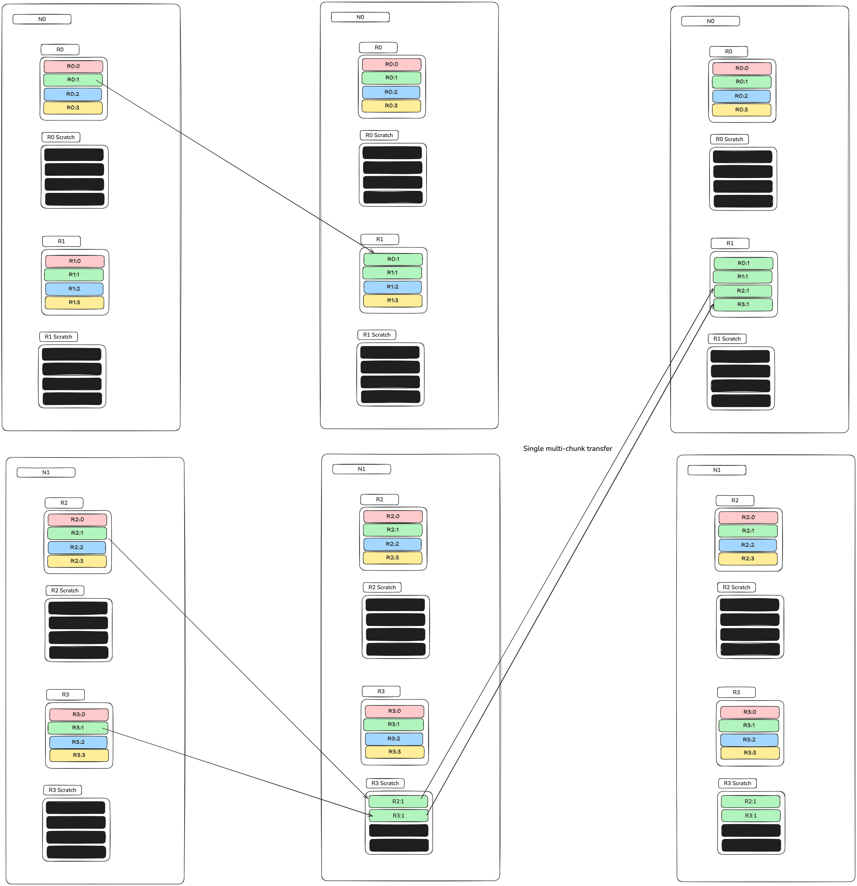
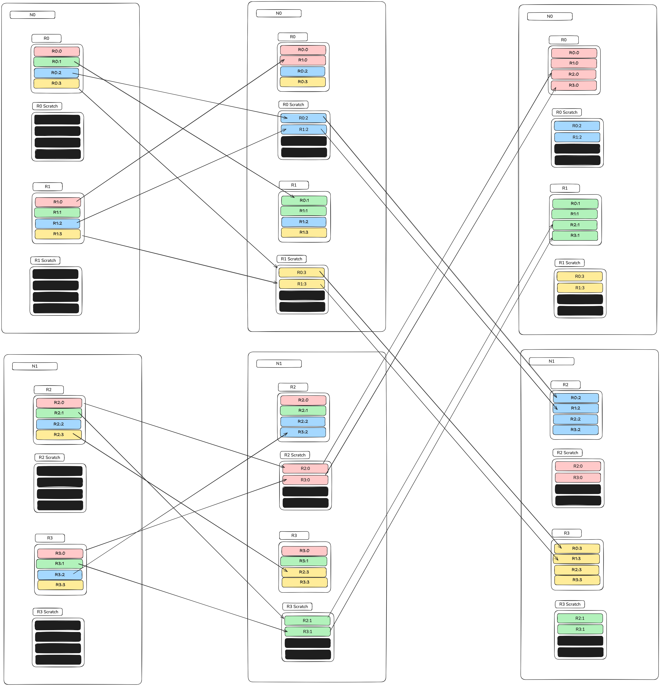
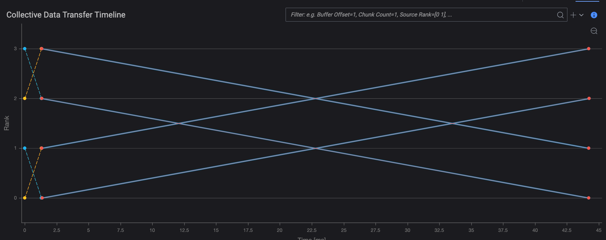
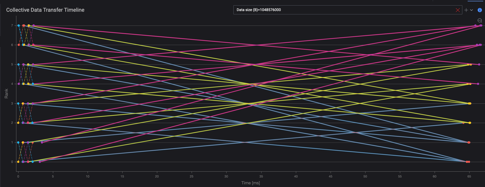
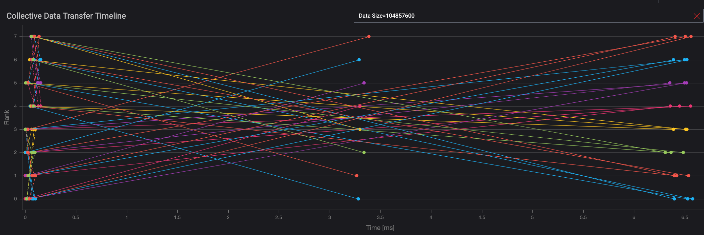
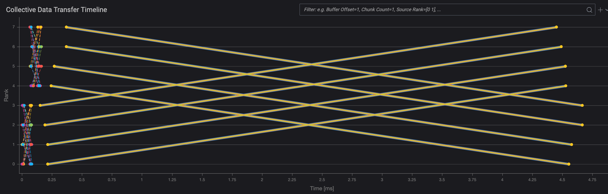

# AlltoAll PXN Collective Algorithm

The AlltoAll PXN is an collective algorithm available in the Collective Benchmarks application of KAI DCB.
The **AlltoAll PXN** (AlltoAll with PCI × NVLink) algorithm is designed to optimize GPU-to-GPU data transfers across multi-server systems by intelligently utilizing both **PCIe** and **NVLink** interconnects. This optimization avoids high-latency “rail-crossing” transfers by enabling intra-server data movement prior to inter-server communication.

---

## Topology

In a **rail-optimized topology**, GPUs with the same index across multiple servers are connected to the same switch. For example, GPU 0 in each server connects to Switch 0 via NIC 0. These logically grouped GPUs and switches form what are commonly known as **rails**.

### Rail Crossing

Data transfer between GPUs with **different indices** (e.g., GPU 0 → GPU 3 across servers) is referred to as **crossing rails**, which typically incurs a higher latency due to the increased number of network hops.

### PXN Optimization

PXN mitigates this latency by performing intra-server transfers before sending data across servers:

1. Data is first transferred via **NVLink** within the source server to a GPU that shares a rail with the destination GPU.
2. The recipient GPU then sends the data out via **PCIe** to the NIC corresponding to its rail.
3. The data reaches the destination GPU on the remote server without crossing rails.

*Source: Nvidia https://developer.nvidia.com/blog/doubling-all2all-performance-with-nvidia-collective-communication-library-2-12/*

---

## AlltoAll PXN Collective Communication

The **All-to-All (AlltoAll)** collective operation requires every rank to exchange data with every other rank. The PXN algorithm aims to perform this exchange without rail crossings.

### Example: Two Hosts, Four Ranks

Consider a system with:

- 2 hosts
- 4 ranks (2 per host)
- Rail 0 would be the subnetwork connecting Rank 0 and Rank 2
- Rail 1 would be the subnetwork connecting Rank 1 and Rank 3

The algorithm is to move all data within each server that is destined for a rank on a certain rail to the local rank that is on that rail.

Once each rank has aggregated the outgoing data, it is sent over the network to the destination rank.

This is a four rank, two server AlltoAll-pxn diagram focusing on the movement of data destined for Rank 1:

*Algorithm timeline*

The box labeled N0 represents Server 0 and the box labeled N1 represents N1.

The boxes labeled RN represent the result buffer of each respective Rank N.

The boxes labeled RN Scratch represent transient buffers of each respective Rank N. The purpose of these is to aggregate data that is destined for another server.

The diagram is meant to be read as a timeline from left to right; all ranks at T0, all ranks at T1, all ranks at T2.

At the end of the collectige, Rank 1 should have Chunk 1 from every other rank.

**T0-T1:**
- Rank 0 sends Chunk 1 directly to Rank 1. Since both ranks are on the same server, this can be done over NPU Interconnect.
- Rank 2 sends Chunk 1 directly to Rank 3's scratch buffer. Since both ranks are on the same server, this can be done over NPU Interconnect.
- Rank 3 copies Chunk 1 from its result buffer to its scratch buffer. No data exits the rank.

**T1-T2:**
- Rank 3 sends the aggregated Chunk 1s (Chunk 1 from Rank 2, Chunk 1 from itself) over the network to Rank 1.

> Result: Rank 1 has received Chunk 1 from Ranks 0, 2, and 3 without any cross-rail transfers.

*Algorithm timeline showing all data transfers*

The collective data transfer timeline in KAI DCB Collective Benchmark application for the given example is depicted below.

*Collective Data Transfer Timeline for 2 hosts, 2 ranks per host*

> **Note:**
> - NPU Interconnect transfers may overlap, filtering + zoom must be used identify all individual data chunk transfers.
> - Intra-rank buffer copies are **implied** and not directly observable.
> - Inter-host chunk indices reference **scratch buffers**, not original sources.

### Example: Four hosts, two ranks per host

*Collective Data Transfer Timeline for 4 hosts, 2 ranks per host*

Observations:
- The traffic pattern is essentially the same as a 4 rank AlltoAll.
- Even though no rails are crossed, there are still incast traffic patterns within each rail.
- There is no difference in the amount of data sent over the network compared to regular AlltoAll with NPU Interconnect.
- All things being equal, there should not be much of a performance boost in this configuration.

---

## Performance Considerations

PXN vs Non-PXN Example (Two Hosts, Four Ranks Each)

### Without PXN

| Data Size    | Collective   | Completion Time (ms) | Algbw (GB/s) | Busbw (GB/s) | Ideal (%) |
|--------------|--------------|-----------------------|--------------|--------------|------------|
| 104,857,600  | ALL_TO_ALL-1 | 6.58                  | 15.94        | 13.95        | 64.32      |

### With PXN

| Data Size    | Collective   | Completion Time (ms) | Algbw (GB/s) | Busbw (GB/s) | Ideal (%) |
|--------------|--------------|-----------------------|--------------|--------------|------------|
| 104,857,600  | ALL_TO_ALL-1 | 4.67                  | 22.46        | 19.66        | 90.40      |

In configurations with only two hosts, rail-only traffic also eliminates incast issues, resulting in significant performance gains.

---

## Limitations and Requirements

- **NPU Interconnect Required:**
  The emulated host must have NPU Interconnect enabled. Otherwise, an exception is raised.

- **Algorithm Assumptions:**
  - Takes into account the number of hosts and ranks per host.
  - Does **not** infer or adapt to the actual network topology.
  - Intra-host transfers are **emulated**.

- **User Responsibilities:**
  - Ensure that the network topology is configured appropriately (e.g., rail-optimized).
  - Assess if PXN will yield performance improvements over standard A2A based on the system configuration.

- **Inter-host Guarantee:**
  - PXN guarantees rail-only **inter-host** communication.
  - Minor cross-rail **intra-host** synchronization messages may still occur due to the implementation of NPU Interconnect.

> **Caution:**
> The implementation of the NPU Interconnect feature (intra-host traffic) requires small cross-rail synchronization messages.
> As such, PXN may not be compatible with strict rail-only networks. See: [This AI Network Has No Spine—and That’s a Good Thing](https://www.nextplatform.com/2024/08/23/this-ai-network-has-no-spine-and-thats-a-good-thing/)

