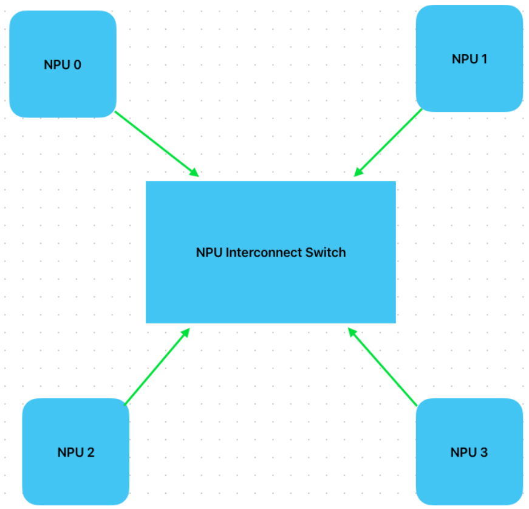

# xPU Interconnect Emulation

The KAI Data Center Builder supports the emulation of generic hosts using a streamlined xPU Interconnect model.

> Originally the term NPU (Neural Processing Unit) Interconnect was used, but it has been renamed to xPU Interconnect to reflect the established terminology in the industry.

## What we emulate within a host

In this emulation, the user-specified bandwidth applies to each individual xPU-to-switch link.

All data transfers between ranks within a host, connected through the xPU Interconnect, are fully simulated.

## Transfer Duration Calculation

The duration of each simulated xPU Interconnect transfer is determined by dividing the transfer size by the configured
bandwidth. That is:

    Transfer Duration = Transfer Size / Configured Bandwidth

This calculation assumes that each transfer fully utilizes the available bandwidth, irrespective of other concurrent
transfers on the same link.

#### Special Case: Ring Collectives
For ring-based collective algorithms, the duration is adjusted based on the number of concurrent rings:

    Ring Transfer Duration = Transfer Size / (Configured Bandwidth / Number of Rings)

A simple heuristic is applied to approximate link contention in this case.

#### Other Collective Operations
For all other types of collective operations, link contention is not modeled, and the duration remains:

    Transfer Duration = Transfer Size / Configured Bandwidth

### Known limitations

#### Synchronization Flows

To preserve the ordering and dependency of traffic flows, a synchronization mechanism is required. For each xPU
Interconnect transfer, a synchronization flow with a 1 KB payload is generated and observable on the wire. However, the
latency introduced by this synchronization flow is **not** included in the simulation

#### Accuracy Constraints

The simulation assumes that network flows are not faster than xPU Interconnect transfers.
If this assumption does not hold, simulation fidelity may be impacted.

Examples:
- In **broadcast** and other parallel collectives, once xPU Interconnect is fast enough to complete its transfers ahead
of network communication, collective completion time becomes dominated by network flow latency.
- In **ring algorithms**, once the xPU Interconnect allows full NIC utilization across all hosts, increasing its
bandwidth further yields no performance gains — the network becomes the bottleneck.
